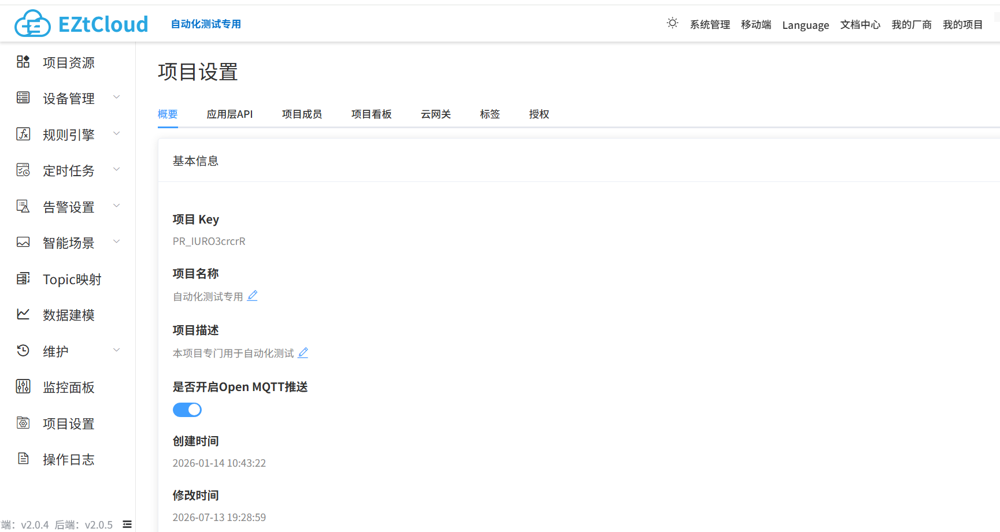

# MQTT API

EZtCloud 支持开放的 MQTT 应用端订阅服务，帮助您在自有软件应用或第三方应用中实时接收设备的最新消息。

您不仅可以在服务器上订阅设备消息，也可以在基于浏览器的 Web 应用中通过 **Javascript** 和 **MQTT@Websocket** 直接订阅设备实时消息，来实现 Web 页面实时更新设备数据，这在开发物联网数据可视化界面时发挥重要的作用。


> **💡 提示**
>
> EZtCloud 提供的 MQTT 应用端订阅服务，与设备的 MQTT 接入并不是同一个 MQTT 服务，请您使用相应的 MQTT 应用端订阅服务地址和主题。新建项目的Open MQTT推送服务默认关闭，订阅前可先在如下图项目设置-概要页面中，确保已开启了该项目的Open MQTT推送服务。



## 支持订阅哪些消息？

应用端通过 MQTT 应用端订阅可以获得的消息包括：

- 设备属性变化（包括属性上报、属性下发、云端属性更新）
- 设备事件上报
- 设备命令回复
- 设备自定义数据上报
- 设备告警/恢复
- 设备上线/下线

## 支持发布哪些消息？

- 设备属性下发
- 设备命令下发

## MQTT 连接认证

在 **项目 > 设置 > MQTT 应用端订阅** 中，可以获得 MQTT 证书，包括：

- `projectKey`：作为 MQTT username
- `projectSecret`：作为 MQTT password

## MQTT 地址

MQTT 应用端订阅功能对企业版用户开放，请联系技术支持获得详细使用说明。

可在 **控制台 > 项目设置 > 应用层API** 中获取 **MQTT API 接入点**。

全局的，请使用 `SSL/TLS` 加密访问，为确保数据安全性，全局不支持非加密访问。

不同项目的 API 接入点可能不同，请您以控制台获取的地址为准。

## MQTT 订阅主题

以下主题中的字段说明：

- `<projectKey>`：项目内唯一，可在 **控制台 > 项目设置 > 应用层API** 中获得。
- `<deviceUsername>`：每个设备唯一，可通过设备详情页获得，形如：`DU_xxxxxxxxxx`。
- `+`：表示通配符的主题，可订阅项目中的所有设备。

### 订阅指定设备属性上报

```
open/<projectKey>/<deviceUsername>/attributes
```

**payload**

一个json字符串，样例如下：

```json
{
    "key1": "{value1}",
    "key2": "{value2}"
}
```

### 订阅项目内所有设备属性上报

```
open/<projectKey>/+/attributes
```

**payload**

同 上文“订阅指定设备属性上报”。

### 订阅指定设备事件上报

```
open/<projectKey>/<deviceUsername>/event_report
```

**payload**

一个json字符串，样例如下：

```json
{
    "method": "{name}",
    "params": {
        "key1": "{value1}",
        "key2": "{value2}",
    }
}
```

### 订阅项目内所有设备事件上报

```
open/<projectKey>/+/event_report
```

**payload**

同 上文“订阅指定设备事件上报”。

### 订阅指定设备命令回复

```
open/<projectKey>/<deviceUsername>/command_reply
```

**payload**

一个json字符串，样例如下：

```json
{
    "method": "{name}",
    "params": {
        "key1": "{value1}",
        "key2": "{value2}",
    },
    "id": 1
}
```

### 订阅项目内所有设备命令回复

```
open/<projectKey>/+/command_reply
```

**payload**

同 上文“订阅指定设备命令回复”。

### 订阅指定设备自定义数据上报

```
open/<projectKey>/<deviceUsername>/data/<自定义数据流标识符>
```

**payload**

一个任意字节串，样例如下：

```
fek34j==
```

### 订阅项目内所有设备自定义数据上报

```
open/<projectKey>/+/data/<自定义数据流标识符>
```

**payload**

同 上文“订阅指定设备自定义数据上报”。

### 订阅指定设备告警消息

包含告警触发和告警恢复。

```
open/<projectKey>/<deviceUsername>/alarm
```

**payload**

一个json字符串，样例如下：

```json
{
    // true=告警；false=恢复
    "alerting": true
}
```

### 订阅项目内所有设备告警消息

包含告警触发和告警恢复。

```
open/<projectKey>/+/alarm
```

**payload**

同 上文“订阅指定设备告警消息”。

### 订阅指定设备上线/下线通知

```
open/<projectKey>/<deviceUsername>/online
```

**payload**

一个json字符串，样例如下：

```json
{
    // true=上线；false=下线
    "online": true
}
```

### 订阅项目内所有设备上线/下线通知

```
open/<projectKey>/+/online
```

**payload**

同 上文“订阅指定设备上下线通知”。

## MQTT 发布主题

### 发布指定设备属性下发

```
open/<projectKey>/<deviceUsername>/attributes_push
```

**payload**

一个json字符串，样例如下：

```json
{
    "key1": "{value1}",
    "key2": "{value2}"
}
```

### 发布指定设备命令下发

```
open/<projectKey>/<deviceUsername>/command_send
```

**payload**

一个json字符串，样例如下：

```json
{
    "method": "{name}",
    "params": {
        "key1": "{value1}",
        "key2": "{value2}",
    },
    "id": 1
}
```