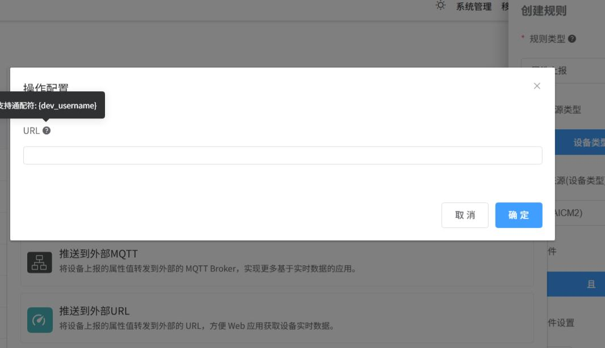

# 属性上报

## 属性上报规则

当云平台接收设备端的属性上报消息，并更新设备属性后，会触发该类规则。

属性上报规则目前支持以下操作：


## 向当前设备下发属性

操作用于向当前设备下发属性，实现设备联动功能。


### 参数

- report_attributes：是设备上报的属性集合，作为参数传入函数。

### 返回值

- object 类型：构造一个下发到目标设备的属性集合。
- null：表示不下发属性到设备。

### 示例

例如，我们需要当设备上报开关量 di1 属性变为 ON 后，自动断开继电器 do1，可以编写如下的云函数：

```jsx
function downAttr(report_attributes) {
  /**
   *report_attributes:  上报的属性对象，作为函数参数传入
   *push_attributes:   构造下发的属性对象，作为函数返回值，下发到硬件
   */
  var push_attributes = {}; // 这里的 === 表示上报属性中必须存在 di1 且为 true
  if (report_attributes.di1 === true) {
    push_attributes.do1 = false;
  }
  return push_attributes;
}
```

## 向当前设备下发命令

该操作用于向当前设备下发命令，实现设备联动功能。


### 参数

- report_attributes：是设备上报的属性集合，作为参数传入函数。

### 返回值

- object 类型：构造一个下发到目标设备的命令消息。
- null：表示不下发命令到设备。

## 推送到外部MQTT

该操作将设备上报的属性直接转发到第三方MQTT服务器，需要填写MQTT主机名、端口、身份验证信息等。


## 推送到外部URL

该操作将设备上报的属性，通过 HTTP 请求转发到您设置的第三方 URL。



### 配置选项

- 推送 URL：填写接收推送消息的第三方 HTTP 接口地址, URL支持通配符: {dev_username}, 值为设备Key。
- 转发消息格式：仅转发设备上报的属性 JSON 内容。
- SSL证书校验：平台默认忽略 SSL 证书校验，避免 SSL 握手失败。

### 请求格式
平台将以 POST 请求向设置的 URL 推送数据，请求头如下：
```text
    Content-Type: application/json
```

### 正文消息格式示例
HTTP 正文仅包含设备上报的属性集合：
{属性标识符: 属性值}
```json
{
  "ua": 223.5,
  "ia": 1.2,
  "temperature": 25.5
}
```


## 向当前网关上报子设备属性

该操作将设备上报的属性转发到子设备，仅用于当前设备是网关类型的情况下。

### 参数

- report_attributes：是设备上报的属性集合，作为参数传入函数。

### 返回值

- object 类型：构造一个向网关上报子设备的消息，消息格式请参考：[上报子设备属性](子设备MQTT接入协议.md#上报子设备属性)。
- null：表示不转发消息到子设备。


### 示例

```jsx
function reportSubAttr(report_attributes) {
  /**
   *report_attributes:  上报的属性对象，作为函数参数传入
   */
  var data = {};
  if (report_attributes.devEUI) {
    data[report_attributes.devEUI] = report_attributes;
  }
  return data;
}
```

## 自定义云函数

自定义云函数操作可处理自定义逻辑，并支持一些内置函数，例如：

- 更新设备云端私有属性
- 给指定设备下发属性
- 给指定设备下发命令