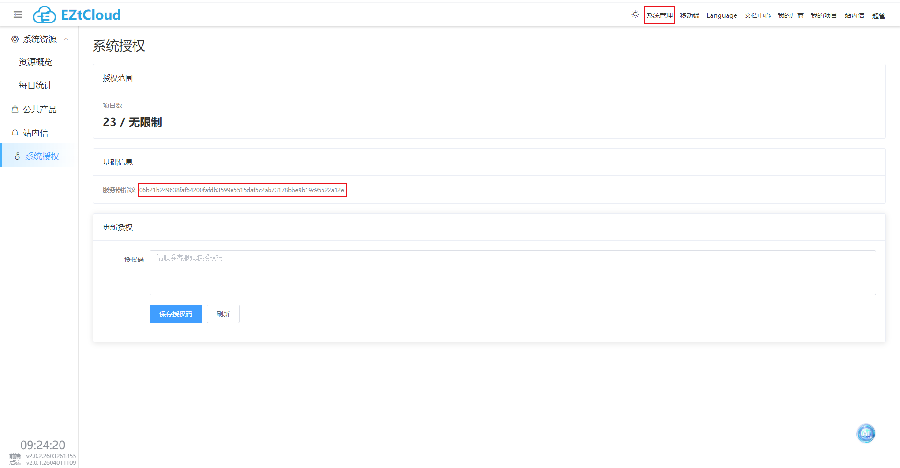
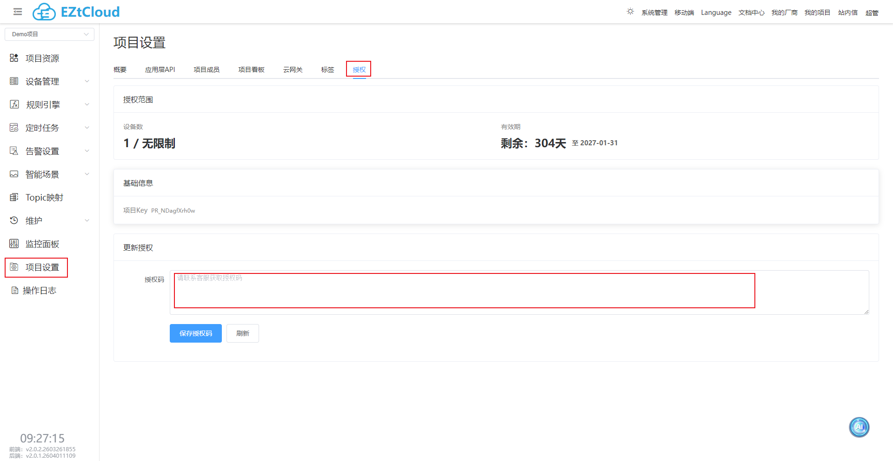

# 授权

> 私有部署完成后，授权分为两类：**系统授权** 和 **项目授权**。请先判断自己的场景，再决定是否需要申请授权码。

## 授权类型说明

## 1）系统授权

用于控制“系统可创建项目数量”。

- 当整个系统**只需要创建 1 个项目**时：通常**无需关注系统授权**。
- 当需要创建**多个项目**时：需要进行系统授权。

申请方式：

1. 登录 EZtCloud，进入：**系统管理** → **系统授权**。

2. 在页面中复制**服务器指纹**。
3. 将服务器指纹发送给我们，联系我们获取系统授权码。
4. 在“系统授权”页面粘贴授权码并保存，点击刷新确认生效。

## 2）项目授权

用于控制“单项目可接入设备数量/授权能力”。

- 当项目设备数**少于 20**时：通常**无需关注项目授权**。
- 当项目设备数**大于等于 20**时：需要进行项目授权。

申请与写入方式：

1. 登录 EZtCloud，进入：**系统管理** → **系统授权**，复制**服务器指纹**（与系统授权步骤相同）。

2. 将服务器指纹及项目授权信息发送给我们，联系我们申请项目授权码。
3. 进入项目：**项目设置** → **授权**。

4. 在项目“授权码”输入框中粘贴并保存，点击刷新确认生效。

## 常见问题

### 1）为什么系统授权要绑定服务器指纹？

系统授权码与服务器环境绑定，用于确保授权与目标部署环境对应。

### 2）什么时候一定要做系统授权？

当你需要在同一套系统中创建多个项目时，需要先完成系统授权。

### 3）什么时候一定要做项目授权？

当项目设备数达到或超过 20 时，建议提前申请并配置项目授权。

### 4）授权码粘贴后未生效怎么办？

建议按以下顺序排查：

- 确认授权码是否完整（无缺失、无多余空格）
- 点击“刷新”重新读取授权状态
- 若仍异常，请将相关页面截图与报错信息反馈给我们
