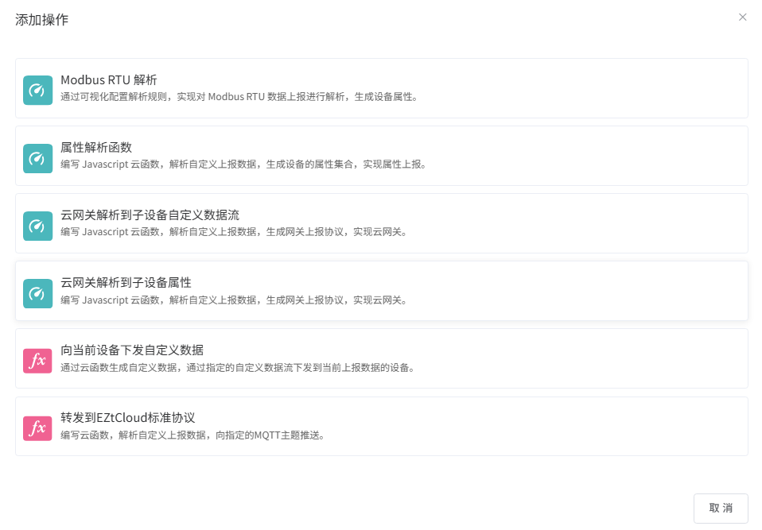

# 自定义数据上报

## 自定义数据上报规则

当云平台接收到设备通过[自定义数据流](自定义数据流.md)上报的消息后，会触发该类规则。

自定义数据上报规则适用于以下场景：

- 设备通过自定义 MQTT Topic 上报非标准格式的数据，需要解析为标准属性
- ModBus RTU 透传设备上报的二进制报文，需要解析为设备属性
- 网关设备上报的自定义数据，需要解析为子设备的属性或数据
- 设备上报的自定义数据，需要转换为 EZtCloud 标准协议格式
- 设备上报自定义数据后，需要向设备下发响应数据

自定义数据上报规则目前支持以下操作：

| 操作类型 | 操作名称 | 适用设备节点 | 适用接入协议 |
| --- | --- | --- | --- |
| DU_MRP | ModBus RTU 解析 | 子设备 / 直连设备 | ModBus RTU 透传 |
| DU_APF | 属性解析函数 | 子设备 / 直连设备 | 不限 |
| DU_CGPF | 云网关解析函数 | 网关 | 其它 |
| DU_USDA | 云网关解析到子设备属性上报 | 网关 | 其它 |
| DU_DCD | 向当前设备下发自定义数据 | 所有设备节点 | 不限 |
| DU_DPM | 转发到EZtCloud标准协议 | 所有设备节点 | 不限 |

---



---

## ModBus RTU 解析 (DU_MRP)

将设备上报的 ModBus RTU 二进制报文，根据配置的 ModBus 寄存器规则，解析为标准设备属性并上报。

本操作适用于：设备接入协议为 **ModBus RTU 透传**，自定义数据流格式为 **ModBus RTU** 的场景。

### 配置参数

- **从机地址 (slave_address)**：ModBus 从机地址，用于校验上报数据中的从机地址是否匹配
- **使用子设备地址 (use_sub_device_address)**：当设备节点为子设备时，可使用子设备地址作为从机地址
- **功能码 (cmd)**：ModBus 功能码（如 03 读保持寄存器、04 读输入寄存器），用于校验
- **校验方式 (check_type)**：CRC16 校验方式
- **寄存器规则 (rules)**：定义如何将 ModBus 寄存器的值解析为设备属性

### 处理流程

1. 校验功能码是否与配置一致
2. 校验从机地址是否匹配
3. CRC16 校验报文完整性
4. 按配置的寄存器规则解析报文，生成设备属性
5. 将解析后的属性以上报方式推入上行队列

---

## 属性解析函数 (DU_APF)

通过用户自定义的 JavaScript 函数，将设备上报的自定义数据解析为标准设备属性并上报。

本操作适用于：数据格式较灵活、需要自定义解析逻辑的场景，可弥补 ModBus RTU 解析操作无法修改解析结果的不足。

### 参数

- **data**：设备上报的自定义数据，作为参数传入 JavaScript 函数。

### 返回值

- **object 类型**：一个属性键值对对象，将被上报为设备标准属性。
- **空对象**：表示不产生任何属性。

### 示例

例如，设备上报了一个自定义二进制报文，需要从中提取温度、湿度等属性：

```jsx
function parseAttr(data) {
  /**
   * data: 设备上报的自定义数据
   * 返回: 属性键值对对象
   */
  var attrs = {};
  // 解析二进制报文...
  attrs.temperature = 25.6;
  attrs.humidity = 68.3;
  return attrs;
}
```

---

## 云网关解析函数 (DU_CGPF)

将网关上报的自定义数据，通过用户自定义 JavaScript 函数解析为子设备的自定义数据，重新上报。

本操作适用于：设备节点为 **网关**，网关接入协议为 **其它**，所选自定义数据流格式为 **非 ModBus RTU** 的场景。

> 说明：ModBus RTU 格式的数据流所对应的网关接入协议为 ModBus RTU 云网关，由系统自动分发到子设备，无需配置此操作。

### 参数

- **data**：网关上报的自定义数据。可使用内置变量 `sub_devices` 获取网关下的子设备列表。

### 返回值

返回以下两种格式之一：

**格式一：object 类型（按子设备编码映射数据）**

```jsx
{
  "SUB_DEVICE_CODE1": "data1",
  "SUB_DEVICE_CODE2": "data2"
}
```

**格式二：array 类型（按子设备地址映射数据）**

```jsx
[
  {
    "device": ["DEV1", "DEV1-1"],
    "data": "data1"
  },
  {
    "device": ["DEV2", "DEV2-1"],
    "data": "data2"
  }
]
```

其中 `device` 为子设备的级联地址数组。

---

## 云网关解析到子设备属性上报 (DU_USDA)

将网关上报的非标准数据，通过用户自定义 JavaScript 函数转化为子设备的标准属性上报。

本操作适用于：设备节点为 **网关**，网关接入协议为 **其它**，处理的消息类型为 `gateway_attributes` 的场景。

### 参数

- **data**：网关上报的数据。可使用内置变量 `sub_devices` 获取网关下的子设备列表。

### 返回值

返回以下两种格式之一：

**格式一：object 类型（按子设备编码映射属性）**

```jsx
{
  "SUB_DEVICE_ADDR1": {
    "ATTRIBUTE1": VALUE1,
    "ATTRIBUTE2": VALUE2
  },
  "SUB_DEVICE_ADDR2": {
    "ATTRIBUTE1": VALUE1,
    "ATTRIBUTE2": VALUE2
  }
}
```

**格式二：array 类型（按子设备地址映射属性）**

```jsx
[
  {
    "device": ["DEV1", "DEV1-1"],
    "attributes": {
      "ATTRIBUTE1": VALUE1,
      "ATTRIBUTE2": VALUE2
    }
  },
  {
    "device": ["DEV2", "DEV2-1"],
    "attributes": {
      "ATTRIBUTE1": VALUE1,
      "ATTRIBUTE2": VALUE2
    }
  }
]
```

---

## 向当前设备下发自定义数据 (DU_DCD)

设备上报自定义数据后，通过用户自定义 JavaScript 函数构造响应数据，下发回当前设备。

本操作适用于：所有设备节点、所有接入协议，需要对上报数据做出响应的场景。

### 参数

- **data**：设备上报的自定义数据。

### 返回值

```jsx
{
  // 设备所属网关的自定义数据流为高级 Topic 模式时，需指定 Topic 中的自定义参数
  "params": {"deveui": "12B*****"},

  // 消息类型。支持：text, json, hex
  "type": "text",

  // 需要向设备下发的数据
  "msg": "/wNYAg=="
}
```

返回 `null` 或空值表示不下发数据。

### 下发通道

- **MQTT**：通过系统内置 MQTT 通道下发，需指定 `data_stream`（自定义数据流标识符）
- **HTTP**：通过外部 HTTP 接口下发，需配置 `url`（外部 HTTP 地址）

---

## 转发到EZtCloud标准协议 (DU_DPM)

将自定义上报的设备数据，通过用户自定义 JavaScript 函数解析后，转发到当前设备的 EZtCloud 标准协议 MQTT Topic 上。

本操作适用于：需要将非标准自定义数据转化为标准协议消息进行后续处理的场景。

### 参数

- **data**：设备上报的自定义数据。

### 返回值

返回一个数组，每个元素包含：

```jsx
[
  {
    // 消息类型（必填），支持以下类型：
    "msg_type": "attributes",

    // 消息内容（必填），格式取决于 msg_type
    "msg": {
      "temperature": 25.6,
      "humidity": 68.3
    }
  }
]
```

最多支持一次返回 10 条消息。

#### 支持的消息类型 (msg_type)

| msg_type | 说明 |
| --- | --- |
| attributes | 属性上报 |
| attributes_get | 属性获取 |
| event_report | 事件上报 |
| gateway_connect | 网关上报子设备连接 |
| gateway_disconnect | 网关上报子设备断开连接 |
| gateway_attributes | 网关上报子设备属性 |
| gateway_attributes_get | 网关获取子设备属性 |
| gateway_event_report | 网关上报子设备事件 |
| sub_connect | 上报子设备上线通知 |
| sub_disconnect | 上报子设备下线通知 |
| sub_attributes | 上报子设备属性 |
| sub_attributes_get | 获取子设备云端属性 |
| sub_event_report | 上报子设备事件 |
| sub_attributes_push | 云端下发属性至子设备 |

---

## 数据处理流程

设备通过自定义数据流上报数据的完整处理流程如下：

```
设备上报自定义数据
  (MQTT: data/{username}/{identifier} 或 TCP/HTTP)
        |
        v
  [数据格式校验]
    - JSON: 校验 JSON 格式合法性
    - HEX: 转换为十六进制
    - PlainText: 校验文本编码
    - ModBus RTU: CRC16 校验
        |
        v
  [ModBus 前置处理]（接入协议为 MGRP/MRP 时）
    - MGRP (云网关): 按从机地址分发到对应子设备
    - MRP (透传): 根据 ModBus 配置解析属性
        |
        v
  [规则引擎触发]
    - 查询匹配的 DU 类型规则
    - 规则条件: device_username + data_stream_identifier
        |
        v
  [按序执行操作]
    - DU_MRP  → ModBus RTU 解析
    - DU_APF  → 属性解析函数
    - DU_CGPF → 云网关解析函数
    - DU_USDA → 云网关解析到子设备属性上报
    - DU_DCD  → 向当前设备下发自定义数据
    - DU_DPM  → 转发到EZtCloud标准协议
```

---

## 相关文档

- [自定义数据流](自定义数据流.md) — 创建和配置自定义数据流
- [创建规则引擎](创建规则引擎.md) — 了解规则引擎的基本概念和创建方式
- [属性上报](属性上报.md) — 标准属性上报规则
- [事件上报](事件上报.md) — 事件上报规则
- [子设备MQTT接入协议](子设备MQTT接入协议.md) — 子设备接入及消息格式
